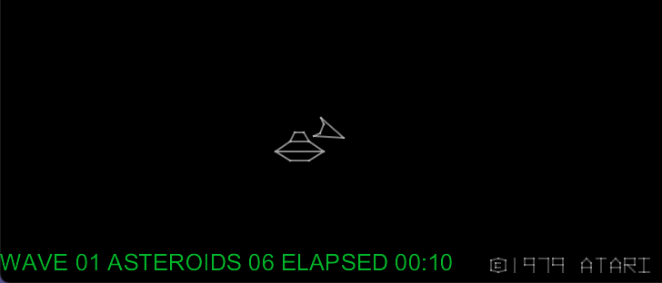

# asteroids_stats

A Lua plugin for [MAME](https://www.mamedev.org) that tracks Asteroids stats

## Instructions

1. Install the plugin files
    1. Go to your MAME installation directory and create a directory named asteroids_plugins in the plugins subdirectory.
    1. Copy the two files init.lua and plugin.json into the asteroids_plugins directory.
1. Enable this plugin. The usual way to do this is by editing the mame.ini file and adding 'asteroids_stats' to the plugin option.

Now that this enabled, the next time you play Asteroids, this plugin will run and emit information to the console.

**NOTE:** This only works for one player games!
**NOTE:** This works on playback of recorded games!

## Output

The display of the stats is in the lower-left corner of the game.



When you play the game from command-line, you will also see output like below. 

**NOTE:** This doesn't have file output yet!

```
rick@Mac:~/Projects/mame0258-x86 $ time ./mame asteroid -window -nomax
ASTEROIDS: Stats Plugin On
Number of ships: 3
start_wave_time: 2
Wave: 1 Asteroids: 4
Wave: 1 Asteroids: 6
Wave: 1 Asteroids: 8
Wave: 1 Asteroids: 7
Wave: 1 Asteroids: 9
Wave: 1 Asteroids: 8
Wave: 1 Asteroids: 7
Wave: 1 Asteroids: 6
Wave: 1 Asteroids: 5
Wave: 1 Asteroids: 4
Wave: 1 Asteroids: 3
Wave: 1 Asteroids: 5
Wave: 1 Asteroids: 7
Wave: 1 Asteroids: 6
Wave: 1 Asteroids: 8
Wave: 1 Asteroids: 7
Wave: 1 Asteroids: 6
Wave: 1 Asteroids: 5
Wave: 1 Asteroids: 4
Wave: 1 Asteroids: 6
Wave: 1 Asteroids: 5
Wave: 1 Asteroids: 7
Wave: 1 Asteroids: 6
Wave: 1 Asteroids: 5
Wave: 1 Asteroids: 7
Wave: 1 Asteroids: 6
Wave: 1 Asteroids: 8
Wave: 1 Asteroids: 10
Wave: 1 Asteroids: 9
Wave: 1 Asteroids: 8
Wave: 1 Asteroids: 7
Wave: 1 Asteroids: 6
Wave: 1 Asteroids: 8
Wave: 1 Asteroids: 7
Wave: 1 Asteroids: 6
Wave: 1 Asteroids: 5
Wave: 1 Asteroids: 4
Wave: 1 Asteroids: 3
Wave: 1 Asteroids: 2
Wave: 1 Asteroids: 1
Wave: 1 Asteroids: DONE Elapsed: 00:00:29.777
Wave: 2 Asteroids: 6
Wave: 2 Asteroids: 8
Wave: 2 Asteroids: 10
Wave: 2 Asteroids: 12
Wave: 2 Asteroids: 11
Wave: 2 Asteroids: 13
Wave: 2 Asteroids: 12
Wave: 2 Asteroids: 11
Wave: 2 Asteroids: 10
Wave: 2 Asteroids: 9
Wave: 2 Asteroids: 8
Wave: 2 Asteroids: 10
Wave: 2 Asteroids: 9
Wave: 2 Asteroids: 8
Wave: 2 Asteroids: 10
Wave: 2 Asteroids: 12
Wave: 2 Asteroids: 14
Wave: 2 Asteroids: 16
Wave: 2 Asteroids: 15
Wave: 2 Asteroids: 14
Wave: 2 Asteroids: 16
Wave: 2 Asteroids: 15
Wave: 2 Asteroids: 14
Number of ships: 2
Wave: 2 Asteroids: 13
Wave: 2 Asteroids: 12
Wave: 2 Asteroids: 11
Wave: 2 Asteroids: 10
Wave: 2 Asteroids: 12
Wave: 2 Asteroids: 14
Wave: 2 Asteroids: 13
Wave: 2 Asteroids: 12
Wave: 2 Asteroids: 14
Wave: 2 Asteroids: 13
Wave: 2 Asteroids: 12
Wave: 2 Asteroids: 11
Wave: 2 Asteroids: 13
Wave: 2 Asteroids: 12
Wave: 2 Asteroids: 11
Wave: 2 Asteroids: 10
Wave: 2 Asteroids: 9
Wave: 2 Asteroids: 8
Wave: 2 Asteroids: 10
Wave: 2 Asteroids: 9
Wave: 2 Asteroids: 8
Wave: 2 Asteroids: 7
Wave: 2 Asteroids: 9
Wave: 2 Asteroids: 8
Wave: 2 Asteroids: 7
Wave: 2 Asteroids: 6
Wave: 2 Asteroids: 5
Wave: 2 Asteroids: 4
Wave: 2 Asteroids: 6
Wave: 2 Asteroids: 5
Wave: 2 Asteroids: 4
Wave: 2 Asteroids: 6
Wave: 2 Asteroids: 5
Wave: 2 Asteroids: 4
Wave: 2 Asteroids: 3
Wave: 2 Asteroids: 2
Wave: 2 Asteroids: 1
Wave: 2 Asteroids: DONE Elapsed: 00:00:45.884
Wave: 3 Asteroids: 8
Wave: 3 Asteroids: 10
Wave: 3 Asteroids: 12
Wave: 3 Asteroids: 11
Wave: 3 Asteroids: 10
Wave: 3 Asteroids: 12
Wave: 3 Asteroids: 14
Wave: 3 Asteroids: 13
Wave: 3 Asteroids: 12
Wave: 3 Asteroids: 11
Wave: 3 Asteroids: 13
Wave: 3 Asteroids: 15
Wave: 3 Asteroids: 14
Wave: 3 Asteroids: 13
Wave: 3 Asteroids: 12
Wave: 3 Asteroids: 14
Wave: 3 Asteroids: 16
Wave: 3 Asteroids: 15
Wave: 3 Asteroids: 17
Wave: 3 Asteroids: 19
Wave: 3 Asteroids: 18
Wave: 3 Asteroids: 17
Wave: 3 Asteroids: 16
Wave: 3 Asteroids: 18
Wave: 3 Asteroids: 17
Wave: 3 Asteroids: 16
Wave: 3 Asteroids: 15
Wave: 3 Asteroids: 17
Wave: 3 Asteroids: 19
Wave: 3 Asteroids: 18
Wave: 3 Asteroids: 17
Wave: 3 Asteroids: 19
Wave: 3 Asteroids: 18
Wave: 3 Asteroids: 17
Wave: 3 Asteroids: 16
Wave: 3 Asteroids: 15
Wave: 3 Asteroids: 14
Wave: 3 Asteroids: 16
Wave: 3 Asteroids: 15
Wave: 3 Asteroids: 14
Wave: 3 Asteroids: 13
Wave: 3 Asteroids: 15
Wave: 3 Asteroids: 14
Wave: 3 Asteroids: 13
Wave: 3 Asteroids: 12
Wave: 3 Asteroids: 11
Wave: 3 Asteroids: 10
Wave: 3 Asteroids: 12
Wave: 3 Asteroids: 14
Wave: 3 Asteroids: 13
Wave: 3 Asteroids: 12
Wave: 3 Asteroids: 11
Wave: 3 Asteroids: 13
Wave: 3 Asteroids: 15
Wave: 3 Asteroids: 14
Wave: 3 Asteroids: 13
Wave: 3 Asteroids: 12
Wave: 3 Asteroids: 11
Wave: 3 Asteroids: 10
Wave: 3 Asteroids: 12
Wave: 3 Asteroids: 14
Wave: 3 Asteroids: 13
Wave: 3 Asteroids: 12
Wave: 3 Asteroids: 11
Wave: 3 Asteroids: 10
Wave: 3 Asteroids: 9
Number of ships: 1
Wave: 3 Asteroids: 8
Wave: 3 Asteroids: 7
Wave: 3 Asteroids: 9
Wave: 3 Asteroids: 8
Wave: 3 Asteroids: 7
Wave: 3 Asteroids: 6
Wave: 3 Asteroids: 8
Wave: 3 Asteroids: 7
Wave: 3 Asteroids: 6
Wave: 3 Asteroids: 5
Wave: 3 Asteroids: 4
Number of ships: 2
Wave: 3 Asteroids: 3
Wave: 3 Asteroids: 2
Wave: 3 Asteroids: 1
Wave: 3 Asteroids: DONE Elapsed: 00:00:53.215
Wave: 4 Asteroids: 10
Wave: 4 Asteroids: 12
Wave: 4 Asteroids: 11
Wave: 4 Asteroids: 13
Wave: 4 Asteroids: 15
Wave: 4 Asteroids: 17
Wave: 4 Asteroids: 19
Wave: 4 Asteroids: 21
Wave: 4 Asteroids: 23
Wave: 4 Asteroids: 22
Wave: 4 Asteroids: 21
Wave: 4 Asteroids: 20
Wave: 4 Asteroids: 22
Wave: 4 Asteroids: 21
Wave: 4 Asteroids: 20
Wave: 4 Asteroids: 19
Wave: 4 Asteroids: 18
Wave: 4 Asteroids: 17
Wave: 4 Asteroids: 16
Wave: 4 Asteroids: 15
Wave: 4 Asteroids: 17
Wave: 4 Asteroids: 19
Wave: 4 Asteroids: 21
Wave: 4 Asteroids: 23
Wave: 4 Asteroids: 22
Wave: 4 Asteroids: 24
Wave: 4 Asteroids: 23
Wave: 4 Asteroids: 25
Wave: 4 Asteroids: 24
Wave: 4 Asteroids: 26
Wave: 4 Asteroids: 25
Wave: 4 Asteroids: 24
Wave: 4 Asteroids: 23
Wave: 4 Asteroids: 25
Wave: 4 Asteroids: 24
Wave: 4 Asteroids: 23
Wave: 4 Asteroids: 22
Wave: 4 Asteroids: 21
Wave: 4 Asteroids: 20
Wave: 4 Asteroids: 19
Wave: 4 Asteroids: 21
Wave: 4 Asteroids: 20
Wave: 4 Asteroids: 19
Wave: 4 Asteroids: 18
Wave: 4 Asteroids: 17
Number of ships: 1
Wave: 4 Asteroids: 19
Wave: 4 Asteroids: 18
Average speed: 100.00% (155 seconds)

real    2m41.576s
user    0m35.730s
sys     0m8.842s
```

## Author

Rick Umali - rickumali@gmail.com
