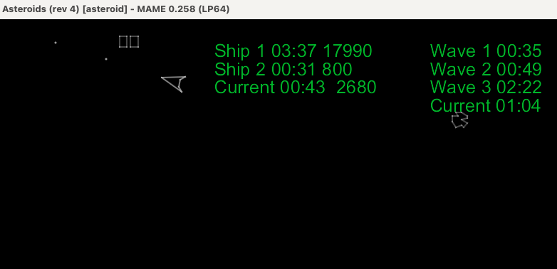

# asteroids_stats

A Lua plugin for [MAME](https://www.mamedev.org) that tracks Asteroids stats

## Instructions

1. Install the plugin files
   1. Go to your MAME installation directory and create a directory named asteroids_plugins in the plugins subdirectory.
   1. Copy the two files init.lua and plugin.json (from the ZIP) into the asteroids_plugins directory.
1. Enable this plugin. The usual way to do this is by editing the mame.ini file and adding 'asteroids_stats' to the plugin option.

Now that this enabled, the next time you play Asteroids, this plugin will run and emit information to the console and the game screen.
s
**NOTE:** This only works for one player games!
**NOTE:** This works on playback of recorded games!

## Configuration

This plugin provides a menu option to control where the heads up display (HUD)
for the statistics should appear: left or right. After you start Asteroids,
Access this menu by pressing `TAB`, then `Plugin Options', then 'Asteroids
Statistics'.

## Output

The display of the stats (current wave count, current asteroids count and
current elapsed time) is located at the bottom of the game screen. It can be configured to
display on the left or the right corner.


The display of the scoreboard (current ship elapsed time and score, and current wave
elapsed time) is in the upper right of the game.

**By default, the display of the scoreboard is OFF. It can be toggled on or off by pressing the 'B' key.**



When you play the game from command-line, you will also see output like below.

**NOTE:** The output below is an excerpt. The asteroids_stats plugin does not have file output yet!

```
rick@Mac:~/Projects/mame0258-x86 $ ./mame asteroid -playback try-05 -window
Input file: try-05
INP version 3.0
Created Mon Sep 18 22:05:12 2023

Recorded using MAME 0.258 (mame0258-dirty)
ASTEROIDS: Stats Plugin On
Wave: 1 Asteroids: 4
Number of ships changed: BEFORE: 0 AFTER: 3
Wave: 1 Asteroids: 6
Actual Score: 20 Diff: 20
Wave: 1 Asteroids: 8
Actual Score: 70 Diff: 50
Actual Score: 170 Diff: 100
Wave: 1 Asteroids: 7
Wave: 1 Asteroids: 6
Wave: 1 Asteroids: 5
...
Wave: 6 Asteroids: 1
Actual Score: 55490 Diff: 1000
Actual Score: 56490 Diff: 1000
Actual Score: 57490 Diff: 1000
Wave: 6 Asteroids: 3
Wave: 6 Asteroids: 2
Actual Score: 57590 Diff: 100
Actual Score: 58590 Diff: 1000
Wave: 6 Asteroids: 1
Actual Score: 59590 Diff: 1000
Wave: 6 Asteroids: DONE Elapsed: 02:12
Wave: 7 Asteroids: 11
Wave: 7 Asteroids: 13
Actual Score: 59610 Diff: 20
Wave: 7 Asteroids: 15
Actual Score: 59660 Diff: 50
Wave: 7 Asteroids: 17
Actual Score: 59710 Diff: 50
Actual Score: 59810 Diff: 100
Actual Score: 59910 Diff: 100
Wave: 7 Asteroids: 16
Wave: 7 Asteroids: 18
Actual Score: 59930 Diff: 20
Wave: 7 Asteroids: 17
Wave: 7 Asteroids: 16
Wave: 7 Asteroids: 15
Actual Score: 60030 Diff: 100
Number of ships changed: BEFORE: 4 AFTER: 5
Wave: 7 Asteroids: 14
Wave: 7 Asteroids: 13
Wave: 7 Asteroids: 12
Wave: 7 Asteroids: 14
Actual Score: 60050 Diff: 20
Wave: 7 Asteroids: 16
Actual Score: 60100 Diff: 50
Actual Score: 60200 Diff: 100
...
Actual Score: 83890 Diff: 50
Actual Score: 83990 Diff: 100
Wave: 9 Asteroids: 23
Actual Score: 84090 Diff: 100
Wave: 9 Asteroids: 22
Wave: 9 Asteroids: 21
Wave: 9 Asteroids: 20
Actual Score: 84190 Diff: 100
Wave: 9 Asteroids: 19
Wave: 9 Asteroids: 21
Actual Score: 84240 Diff: 50
Number of ships changed: BEFORE: 2 AFTER: 1
Wave: 9 Asteroids: 20
Actual Score: 84340 Diff: 100
Wave: 9 Asteroids: 19
Final Score: 84340
Total playback frames: 59624
Average recorded speed: 100%
Exiting MAME now...
Average speed: 97.13% (968 seconds)
```

## Author

Rick Umali - rickumali@gmail.com
