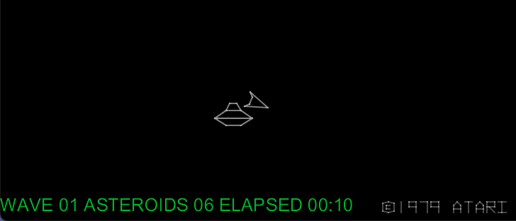
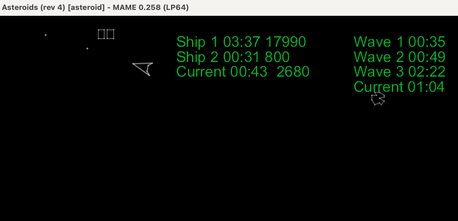

# asteroids_stats

A Lua plugin for [MAME](https://www.mamedev.org) that tracks Asteroids stats

## Instructions

1. Install the plugin files
   1. Go to your MAME installation directory and create a directory named asteroids_plugins in the plugins subdirectory.
   1. Copy the two files init.lua and plugin.json (from the ZIP) into the asteroids_plugins directory.
1. Enable this plugin. The usual way to do this is by editing the mame.ini file and adding 'asteroids_stats' to the plugin option.

Now that this enabled, the next time you play Asteroids, this plugin will run and emit information to the console and the game screen.

**NOTE:** This only works for one player games!
**NOTE:** This works on playback of recorded games!

## Configuration

This plugin provides a menu option to control where the heads up display (HUD)
for the statistics should appear: left or right. After you start Asteroids,
Access this menu by pressing `TAB`, then `Plugin Options', then 'Asteroids
Statistics'.

## Output

The display of the stats (current wave count, current asteroids count and
current elapsed time) is located at the bottom of the game screen. It can be configured to
display on the left or the right corner.



The display of the scoreboard (current ship elapsed time and score, and current wave
elapsed time) is in the upper right of the game.

**By default, the display of the scoreboard is OFF. It can be toggled on or off by pressing the 'B' key.**



When you play the game from command-line, you will also see output like below. Game statistics
are displayed after the final score.

**NOTE:** The output below is an excerpt. The asteroids_stats plugin does not have file output yet!

```
rick@Mac:~/Projects/mame0258-x86 $ ./mame asteroid -playback try-277 -window
Input file: try-277
INP version 3.0
Created Tue Feb 11 20:53:52 2025

Recorded using MAME 0.258 (mame0258-dirty)
ASTEROIDS: Stats Plugin On (0.2.1)
Wave: 1 Asteroids: 4
Number of ships changed: BEFORE: 0 AFTER: 3
Wave: 1 Asteroids: 6
Actual Score: 20 Diff: 20
Wave: 1 Asteroids: 8
Actual Score: 70 Diff: 50
...
Final Score: 177960
Ship 1 03:25 20470
Ship 2 01:31 7550
Ship 3 00:16 670
Ship 4 02:39 21680
Ship 5 00:31 1890
Ship 6 00:14 400
Ship 7 00:37  3100
Wave 1 00:24
Wave 2 00:42
Wave 3 00:58
Wave 4 01:08
Wave 5 01:04
Wave 6 03:08
Wave 7 02:00
Total playback frames: 23095
Average recorded speed: 99%
Exiting MAME now...
Average speed: 100.00% (879 seconds)
```

## Author

Rick Umali - rickumali@gmail.com
